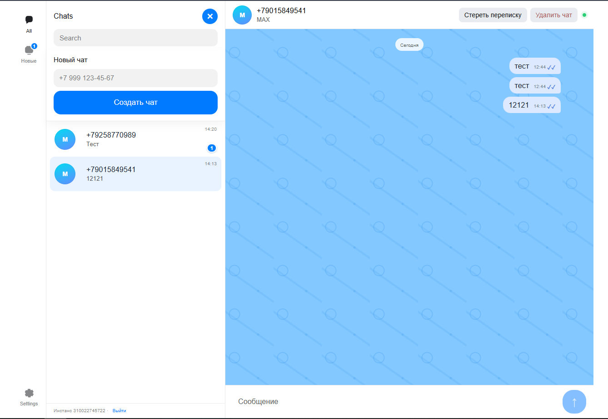

# MAX Chat · GREEN-API

Минимальный React-чат для отправки и получения текстовых сообщений в MAX через HTTP API GREEN-API. Интерфейс использует MAX UI и адаптирован для компьютеров и мобильных экранов.

## Интерфейс



## Возможности

- подключение по `idInstance` и `apiTokenInstance`;
- проверка доступности инстанса;
- создание чата по номеру РФ или РБ через `CheckAccount`;
- хранение нескольких чатов и их сообщений в `localStorage`;
- переключение между сохранёнными диалогами;
- отправка текста методом `SendMessage`;
- получение ответов через `ReceiveNotification`;
- подтверждение обработанных уведомлений через `DeleteNotification`;
- статусы отправки и автоматическое переподключение поллера.

## Подготовка GREEN-API

1. Создайте и авторизуйте MAX-инстанс в личном кабинете GREEN-API.
2. Убедитесь, что в настройках инстанса включены флажки:
   - **Incoming message (Входящие сообщения)** — обязателен для получения ответов (`incomingWebhook`);
   - **Outgoing message (Исходящие сообщения)** — включите, если в чате нужно показывать сообщения, отправленные непосредственно из MAX (`outgoingMessageWebhook`).
3. Для технологии HTTP API оставьте `webhookUrl` пустым.
4. Скопируйте `idInstance` и `apiTokenInstance`.

Без включённого **Incoming message** отправка будет работать, но ответы не попадут в очередь уведомлений. Без **Outgoing message** сообщения, отправленные непосредственно из MAX, не появятся в React-чате.

## Запуск

API-хост задаётся переменной окружения `REACT_APP_GREEN_API_URL`. Если переменная не
указана, используется `https://3100.api.green-api.com`.

```bash
npm install
npm start
```

Приложение откроется по адресу [http://localhost:3000](http://localhost:3000).

## Production-сборка

```bash
npm run build
```

Учётные данные хранятся только в памяти открытой вкладки. Для публичного production-развёртывания рекомендуется перенести обращения к GREEN-API на собственный backend, чтобы токен инстанса не был доступен в браузере.
